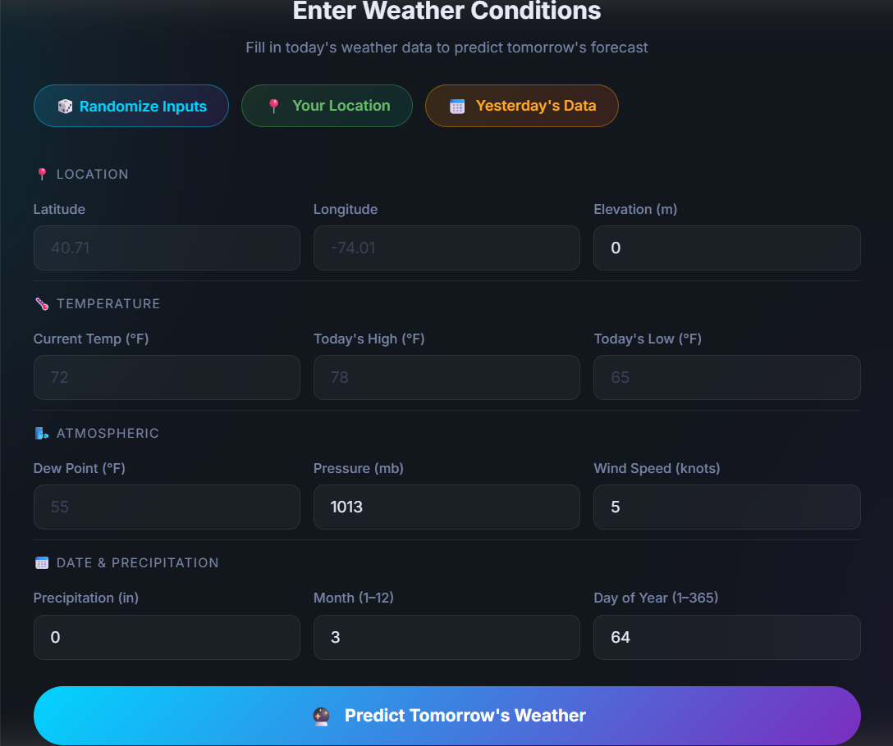
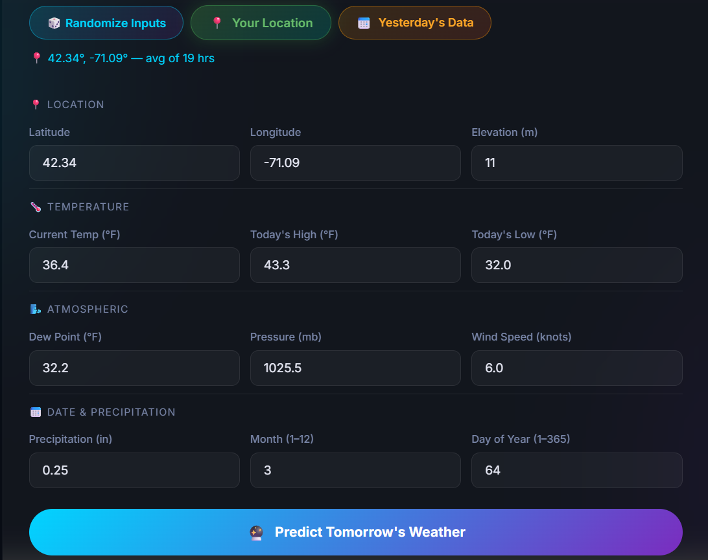
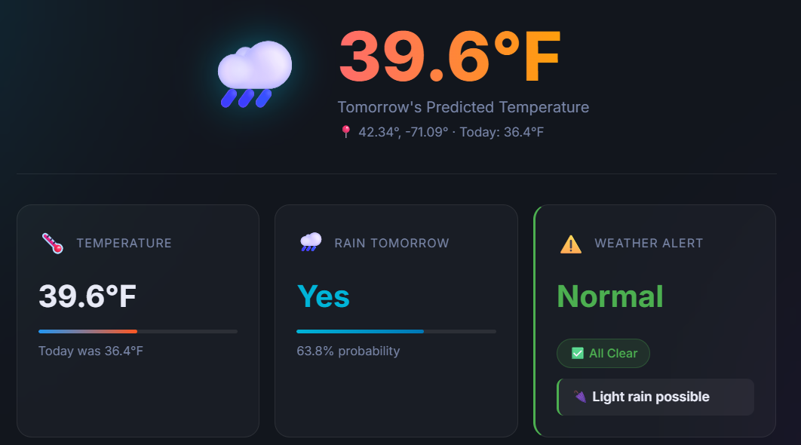
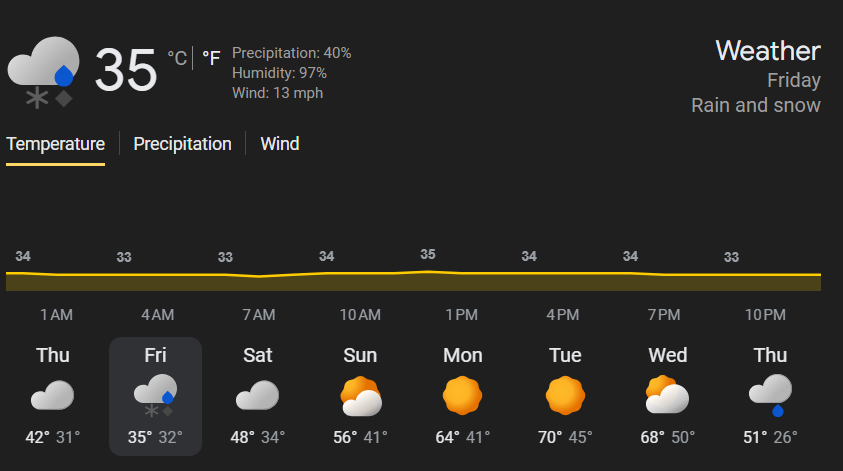
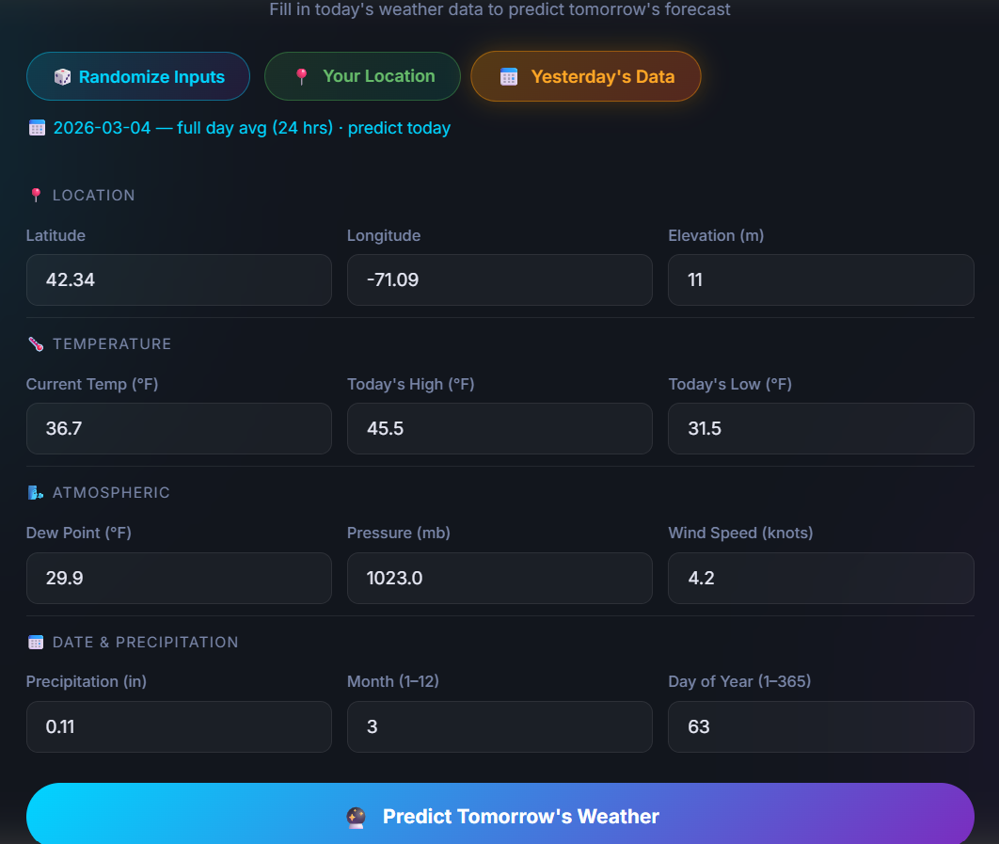
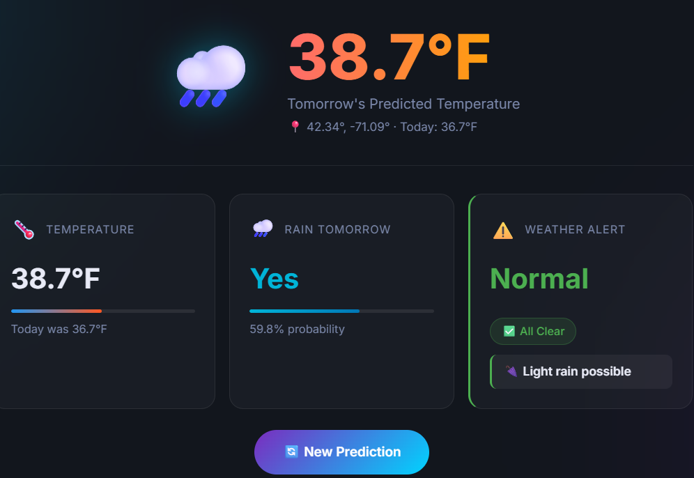
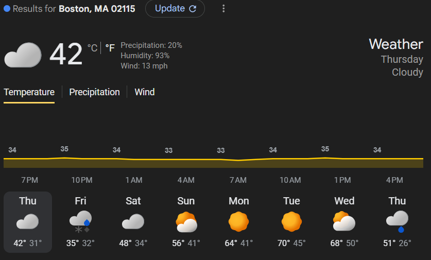
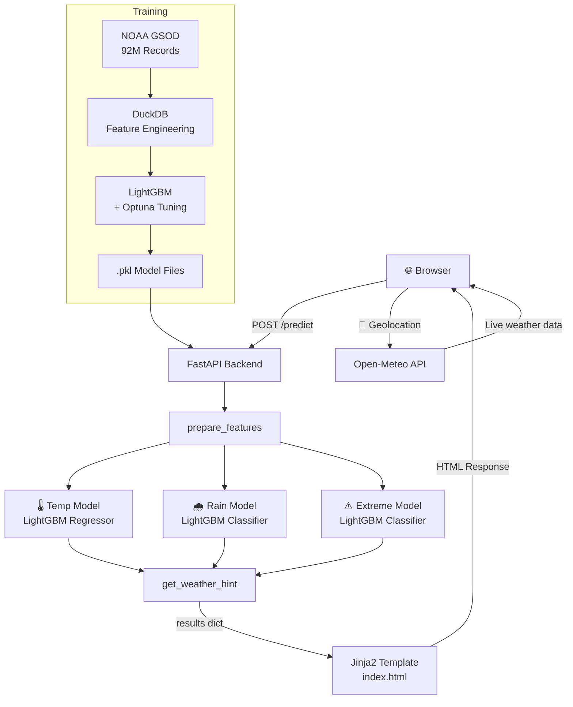

# 🌤️ WeatherCast ML

> Predictive weather forecasting web application powered by machine learning — trained on **92 million** real-world weather records from NOAA's Global Surface Summary of Day (GSOD) dataset.


---

## 🔍 Overview

WeatherCast ML takes today's weather conditions as input and predicts **tomorrow's weather** using three independently trained LightGBM models. It features a live geolocation button that auto-fills all inputs using the Open-Meteo API, and a rich dark-themed UI.

---

## 🖥️ Application Screenshots

### Homepage


---

## 🎬 Demo


---

## 🤖 Models

| Model | Task | Performance |
|---|---|---|
| 🌡️ Temperature | Predict tomorrow's avg temperature (°F) | R² = 0.9669 · MAE = 2.88°F |
| 🌧️ Rain Prediction | Binary classification — will it rain? | Outputs Yes/No + probability % |
| ⚠️ Extreme Weather | 5-class alert detection | Normal / Heat / Cold / Storm / Snow |

All models trained with **LightGBM** using 45 engineered features including lag temperatures, rolling averages, cyclical seasonal encodings, and atmospheric pressure trends.

---

## 🧪 Live Prediction Tests

Two real-world tests performed in **Boston, MA** using live weather data.

### Test 1 — Yesterday's Data Input (March 4, 2026)

**Input** — Yesterday's full-day average fetched automatically via Open-Meteo archive API:



**Model Output** — Predicted **38.7°F** for next day, rain likely at 59.8%:



**Actual Weather** — Google Weather showed **35°F** for Friday (high 35°, low 32°):



> ✅ Prediction was **~3.7°F off** from actual. Rain prediction was correct — Friday had rain and snow.

---

### Test 2 — Your Location Input (March 5, 2026 — avg of 19 hrs)

**Input** — Live location data fetched automatically, averaged over 19 hours of the current day:



**Model Output** — Predicted **39.6°F** for next day, rain likely at 63.8%:



**Actual Weather** — Google Weather showed **35°F** for Friday (high 35°, low 32°):



> ✅ Prediction was **~4.6°F off** from actual. Rain/snow prediction was correct.

---

## 🏗️ Architecture



---

## ⚠️ Limitations

- **Average temperature only** — predicts next-day *mean* temperature, not the high or low. Actual daily average is typically 5–10°F lower than the daytime high shown on Google Weather.
- **No true lag features at inference** — trained with 1/3/7/14-day lag temperatures from historical records. At inference these are approximated using today's temperature, which introduces some error.
- **Best used with yesterday's completed data** — the "Yesterday's Data" button gives the most accurate predictions since it matches the full-day average format the model was trained on. "Your Location" uses a partial-day average which can skew results.
- **Global model, local variance** — trained on 92M records from stations worldwide. Predictions in regions with fewer training stations may be less accurate.
- **No precipitation amount** — rain model outputs Yes/No and a probability, but does not predict how much rain will fall.
- **Extreme weather classes are rare** — Heat, Cold, Storm, and Snow alerts are a small fraction of training data, so the model leans toward predicting "Normal" in borderline cases.

---

## 🚀 Features

- **Live weather input** — "Your Location" button fetches real-time data via Open-Meteo API using browser geolocation
- **Yesterday's data** — fetches completed full-day averages from Open-Meteo's historical archive for accurate predictions
- **Smart randomizer** — 12 pre-loaded real-world scenarios (NYC summer, Chicago blizzard, Miami storm, etc.)
- **Contextual alerts** — dynamic hints like *❄️ Snow likely tomorrow* or *☂️ Bring an umbrella*
- **Model info modals** — click any model card to see architecture, features used, and how it works
- **JSON API** — `/api/predict` endpoint for programmatic access

---

## 🗂️ Project Structure

```
Weather Forecast/
├── main.py                  # FastAPI backend — loads models, routes, prediction logic
├── requirements.txt         # Dependencies
├── templates/
│   └── index.html           # Frontend — dark UI, modals, geolocation, randomizer
├── static/
│   └── style.css            # Styling — glassmorphism, animations, responsive
└── models/                  # LightGBM .pkl model files (not tracked in git)
    ├── weather_model_92M.pkl
    ├── rain_prediction_model.pkl
    └── extreme_weather_model.pkl
```

---

## 🛠️ Tech Stack

| Layer | Technology |
|---|---|
| Backend | FastAPI + Uvicorn |
| ML Models | LightGBM |
| Data Processing | DuckDB · Pandas · NumPy |
| Training Data | NOAA GSOD — 92M records |
| Live Weather | Open-Meteo API (free, no key) |
| Frontend | Vanilla HTML/CSS/JS |

---

## 📡 API

```
GET /api/predict?latitude=40.71&longitude=-74.01&temp=72&dewp=55
                &max_temp=78&min_temp=65&month=6&day_of_year=172
```

**Response:**
```json
{
  "tomorrow_temperature_f": 74.3,
  "rain": {
    "prediction": "No",
    "probability_percent": 18.4
  },
  "extreme_weather": {
    "code": 0,
    "alert": "Normal"
  },
  "hint": "🌤️ Comfortable conditions tomorrow"
}
```

---

## 💻 Try it on your PC

```bash
# 1. Clone the repo
git clone https://github.com/Showrish/Weather-Forecast.git
cd Weather-Forecast

# 2. Install dependencies
pip install -r requirements.txt

# 3. Add your trained models to the /models folder

# 4. Run
uvicorn main:app --reload
```

Then open `http://localhost:8000` in your browser.

---

## 📊 Data & Training

- **Dataset:** [NOAA Global Surface Summary of the Day (GSOD)](https://www.ncei.noaa.gov/access/metadata/landing-page/bin/iso?id=gov.noaa.ncdc:C00516)
- **Size:** 92,209,203 records · 27 features
- **Coverage:** Global weather stations · Year range 2000–2024
- **Feature engineering:** 7/14/30-day lag temps, rolling averages, cyclical month/day encodings, humidity proxy, wind energy
- **Training pipeline:** DuckDB for big data processing → LightGBM with early stopping → Optuna hyperparameter tuning

---

## 📈 Data Insights

### Missing Data per Feature


### Temperature Distribution


### Monthly Climate Trends


### Year-over-Year Temperature Trend


### Feature Correlation Matrix


### Weather Event Frequency


### Hottest & Coldest Stations


### Wind Speed & Pressure vs Temperature


---

## 👤 Author

**Showrish** — Big Data Project 2026